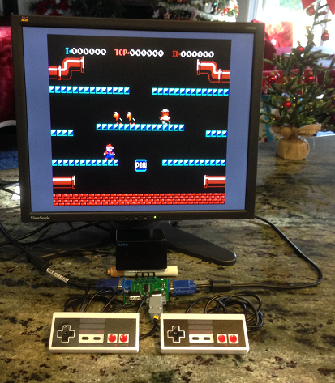
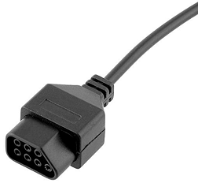

# Port of Brian Bennet's NES Emulator for the second generation Panologic thin client 

# [](./assets/pano_nes_large.png)

If you don't know what a Panologic thin client is please see [here](https://hackaday.com/2013/01/11/ask-hackaday-we-might-have-some-fpgas-to-hack/) 
and [here](https://github.com/skiphansen/pano_hello_g1) for background.

Magnus of Saanlima Electronics did the [original port](https://github.com/Saanlima/Pano_G2C) to the pano,
this project adds the following:

* An RISC-V coprocessor based on Ultraembedded's [fpga_test_soc](https://github.com/ultraembedded/fpga_test_soc)
* Hardware and software interfaces to the Panologic's sound system
* A new APU mixer based on MiSter [project's](https://github.com/MiSTer-devel/NES_MiSTer) mixer
* A spiffs filesystem containing all 48 games from Brian Bennet's original project.
* Firmware to load ROMs from the spiffs filesystem eliminating the need for a PC
* Firmware to interface to original NES controllers connected to the Pano via an I2C port expander.

## Status

Most of the games supported by Brian Bennet's port run with music and are 
playable.

## HW Requirements

* A Pano Logic G2 (the one with a DVI port)
* A suitable 5 volt power supply
* A JTAG programmer to load the bitstream into the FPGA.
* An monitor that with either VGA or DVI connector.

If you want to actually be able to play games you'll also need:

* One or two NES game controllers
* An MCP23017 based I2C port expander board.

## Software Requirements

To program the SPI flash in the Pano with the provided images all you need is 
xc3sprog and GNU make.  You DO NOT need Xilinx's ISE.

If you would like to modify the firmware you'll also need gcc built for 
RISC-V RV32IM.

If you would like to modify the RTL you'll also need Xilinx ISE 14.7.

The free Webpack version of Xilinx [ISE 14.7](https://www.xilinx.com/support/download/index.html/content/xilinx/en/downloadNav/vivado-design-tools/archive-ise.html) is used for development.
Download the latest Windows 10 version which supports the Spartan 6 family of 
chips used in the second generation Panologic device.

## Game Controller Interface

The original NES controller used 4 signals to interface with the handheld
game controllers. Unfortunately the Pano does not have any easily accessible 
"GPIOs". 

The most obvious way to connect a controller to the Pano is to use one of the 
USB  ports, but that's a problem because there's no code for the USB port yet 
and it will be a MAJOR undertaking since the second generation doesn't include
a USB controller, only a PHY.

This was the same situation I ran into a year ago when working on my 
[pano_man](https://github.com/skiphansen/pano_man) project. 

For that project I built an I2C port expander based Joystick interface which 
communicated with the Pano using the DDC I2C lines on the VGA connector.  

The second generation Pano replaced the VGA port with an DVI port, but the DVI 
port still includes the DDC interface. 

My Pano came with a passive DVI to VGA adapter which allows me to use the VGA 
cabling from my Pano Man project without modifications.  All that was necessary 
was to write some firmware for the RISC-V to poll the controllers and to wire 
the controllers to a DB9 connector to replace the Atari 2600 joystick I use for 
Pacman.

Alhought one poll of the controllers requires 50 "bit banged" I2C operations the 
polling rate is 69 Hz.  This is faster than the 60 Hz rate used by the NES core.

3'rd party NES controllers are readily available on both Amazon and ebay.
Make sure you don't accidently buy controllers for the "NES Classic" like I did!

You need a controller with a connector that looks like this:

 

For reference [these](https://www.amazon.com/gp/product/B07BQDFF2B/ref=ppx_yo_dt_b_asin_title_o05_s00?ie=UTF8&psc=1) are the controllers I used.

#### Tom's Joystick Interface

Tom Verbeure has created a [PCB](https://tomverbeure.github.io/2019/02/05/VGA-I2C-My-First-PCB.html) 
for an I2C port expander for the Pano.  One huge advantage of Tom's board is 
that it eliminates the need to build a custom breakout cable.  

Tom has published all of the necessary Gerber files as well as the Kicad
sources for his board [here](https://github.com/tomverbeure/vga_i2c).  

You might also check with Tom to see if he has any spare boards left.

 

#### Homebrew I2C Joystick Interface

Another alternative is to use of the MCP23017 "breakout boards" that are 
available on Amazon or ebay.  The MCP23017 is also available in a 
breadboard friendly DIP package if that's your thing.  

#### Game controller cabling

While it's certainly possible to a modify a DVI cable to breakout the DDC lines 
it's MUCH simpler with a VGA interface since there are a LOT less wires to deal 
with.  If you really want or need to use the DVI interface I'd suggest 
tacking wires onto the DVI connector rather than modifying a DVI cable.

**NB:** The following chart shows the colors of the wires for MY controller,
they do NOT match the orignal NES controller.  You will need to buzz out the 
wires to the orignal connector to determine the correct colors for your 
controller.

| Signal |     MCP23017    | DB9 | NES pin |     Color      |
|--------|-----------------|-----|---------|----------------|
| DO-P1  | 21 - PA0        |  4  |    4    | brown player 1 |
| DO-P2  | 25 - PA4        |  1  |    4    | brown player 2 |
|   CK   | 22 - PA1        |  3  |    2    | blue           |
|   PS   | 23 - PA2        |  2  |    3    | yellow         |
|   GND  | 10, 15, 16, 17  |  8  |    1    | white          |
|   +5V  | 9, 18           |  7  |    7    | red            |

## Possible alternative Game Controller Interface

Long, long after the original NES controller was introduced Nintendo released a 
"NES Classic Edition" for retrogaming enthusiast.  This console used I2C for
controller communications.  This seems like a natural for the Pano, but 
unfortunately the new controllers use 3.3V power and signal levels while the 
Pano uses 5V levels per the DDC standard.

Additionally documentation on these controllers is scarce and it's unclear to 
me if there are two separate I2C buses for two controllers or if the two 
controllers have different I2C addresses and share the same bus.  If two 
buses are required an I2C port expander would also be needed which eliminates
any potential advantage over the older controllers.

## Programming the Pano

Install xc3sprog for your system.  If a binary install isn't available for your
system the original project can be found here: https://sourceforge.net/projects/xc3sprog/.
Sources can be checked out using subversion from https://svn.code.sf.net/p/xc3sprog/code/trunk.

As an alternate if you don't have subversion a fork of the original project
can be found here: https://github.com/Ole2mail/xc3sprog.

If your JTAG cable is not a Digilent JTAG-HS2 then you will need to set the
"CABLE" environment variable to your cable type before loading the bit file.

Refer to the supported hardware [web page](http://xc3sprog.sourceforge.net/hardware.php) page or run  xc3sprog -c 
to find the correct cable option for your device.

**IMPORTANT: There are 2 versions of the Pano Logic G2: some use a Spartan 6 
LX150 while others use an LX100. You should be able to distinguish between the 
two by the revision code: LX150 is rev B and LX100 is rev C.  

The bit file and filesystem must be generated for the correct device, the 
binary images are NOT compatible.  The build system uses the PLATFORM 
environment variable to determine the target device.  If the PLATFORM environment 
variable is not set a revision A or B device is assumed.

Set the PLATFORM environment variable to "pano-g2-c" if your device is a 
revision C before running make or specify it on the make command line.

Once xc3sprog has been in installed the bit file and SPI filesystem can be
programmed into the Pano's SPI flash by running "make prog_all".

```
skip@dell-790:~/pano/working/panog2_nes$ export PLATFORM=pano-g2-c
skip@dell-790:~/pano/working/panog2_nes$ make prog_all
make -C fpga prog_fs
make[1]: Entering directory '/home/skip/pano/working/panog2_nes/fpga'
xc3sprog -c jtaghs2 -v -e -I/home/skip/pano/working/panog2_nes/pano/cores/xc3sprog/xc6slx100.bit /home/skip/pano/working/panog2_nes/prebuilt/nes_spiffs-g2-c.img:w:5111808:bin
XC3SPROG (c) 2004-2011 xc3sprog project $Rev: 774 $ OS: Linux
Free software: If you contribute nothing, expect nothing!
Feedback on success/failure/enhancement requests:
        http://sourceforge.net/mail/?group_id=170565
Check Sourceforge for updates:
        http://sourceforge.net/projects/xc3sprog/develop

Using built-in device list
Using built-in cable list
Cable jtaghs2 type ftdi VID 0x0403 PID 0x6014 Desc "Digilent USB Device" dbus data e8 enable eb cbus data 00 data 60
Using Libftdi, Using JTAG frequency   6.000 MHz from undivided clock
JTAG chainpos: 0 Device IDCODE = 0x04011093     Desc: XC6SLX100
Created from NCD file: top.ncd;UserID=0xFFFFFFFF
Target device: 6slx100fgg484
Created: 2019/11/09 17:34:26
Bitstream length: 8453744 bits
DNA is 0x7950066df552d4ff
done. Programming time 1451.5 ms
JEDEC: 20 20 0x17 0x10
Found Numonyx M25P Device, Device ID 0x2017
256 bytes/page, 32768 pages = 8388608 bytes total
Bulk erase .......................................................... took 68.792 s
Created from NCD file:
Target device:
Created:
Bitstream length: 26214400 bits
Erasing sector 64/65....Writing data page  12799/ 12800 at flash page  32767..
Maximum erase time 757.6 ms, Max PP time 75761 us
Verifying page  12800/ 12800 at flash page  32768
Verify: Success!
USB transactions: Write 113281 read 112762 retries 123883
make[1]: Leaving directory '/home/skip/pano/working/panog2_nes/fpga'
make -C fpga prog_fpga
make[1]: Entering directory '/home/skip/pano/working/panog2_nes/fpga'
xc3sprog -c jtaghs2 -v -I/home/skip/pano/working/panog2_nes/pano/cores/xc3sprog/xc6slx100.bit /home/skip/pano/working/panog2_nes/prebuilt/pano-g2-c.bit
XC3SPROG (c) 2004-2011 xc3sprog project $Rev: 774 $ OS: Linux
Free software: If you contribute nothing, expect nothing!
Feedback on success/failure/enhancement requests:
        http://sourceforge.net/mail/?group_id=170565
Check Sourceforge for updates:
        http://sourceforge.net/projects/xc3sprog/develop

Using built-in device list
Using built-in cable list
Cable jtaghs2 type ftdi VID 0x0403 PID 0x6014 Desc "Digilent USB Device" dbus data e8 enable eb cbus data 00 data 60
Using Libftdi, Using JTAG frequency   6.000 MHz from undivided clock
JTAG chainpos: 0 Device IDCODE = 0x04011093     Desc: XC6SLX100
Created from NCD file: top.ncd;UserID=0xFFFFFFFF
Target device: 6slx100fgg484
Created: 2019/11/09 17:34:26
Bitstream length: 8453744 bits
DNA is 0x7950066df552d4ff
done. Programming time 1450.9 ms
JEDEC: 20 20 0x17 0x10
Found Numonyx M25P Device, Device ID 0x2017
256 bytes/page, 32768 pages = 8388608 bytes total
Created from NCD file: fpga_routed.ncd;UserID=0xFFFFFFFF
Target device: 6slx100fgg484
Created: 2020/01/03 18:40:58
Bitstream length: 26543264 bits
Erasing sector 26/26....Writing data page  12960/ 12961 at flash page  12960..
Maximum erase time 757.9 ms, Max PP time 75786 us
Verifying page  12961/ 12961 at flash page  12961
Verify: Success!
USB transactions: Write 55938 read 55419 retries 56885
make[1]: Leaving directory '/home/skip/pano/working/panog2_nes/fpga'
skip@dell-790:~/pano/working/panog2_nes$
```

## Usage

Once the flash has been update, simply power cycle the Pano.  The Donkey Kong
JR Math game should start and "music" should start playing from the built in 
speaker.  Headphones or an amplified speaker can be connected to the headphone 
jack for better sound.

The embedded file system contains 48 NES games from the orignal project that
are supported.

To say the least, some of the games become annoying rather rapidly but you can 
skip to the next game by pressing the Pano button.

Game information is sent to the serial port when the games are loaded.  Most
games display video almost immediately after load, but a few require a gamepad
button to be pressed.

Clearly game controllers are necessary to actually play the games but the 
opening screens can be previewed without controllers.

## Serial port (Optional)

Ultraembedded's SOC platform which this port is based on includes the ability to 
load firmware over a serial port which is VERY HANDY for code development.  I 
strongly suggest building a serial cable to allow the capability to be used if
you are interested in modifying the firmware.

Please see the [fpga_test_soc](https://github.com/skiphansen/fpga_test_soc/tree/master/fpga/panologic_g2#serial-port) for more information.

### Building everything from sources

1. Clone the https://github.com/skiphansen/panog2_nes repository
2. cd into .../panog2_nes
3. Make sure the RISC-V GCC (built for RV32IM) is in the PATH.
4. Set the PLATFORM environment variable as appropriate for your device.
4. Run "make build_all".

The RTL code's timing is somewhat critical which causes Xilinx's router to
struggle resulting in long run times for bit file generation.  Typical run 
times on my machine are between 10 and 15 minutes, but occasionally they are 
MUCH longer.  

Some runs pass timing, but many (most) do not.  I have not seen a .bit file 
that failed timing actually fail to run.  Of course this is not ideal, but 
this is a hobbist game project not a commercial product.

The core NES code is designed for a 100Mhz clock which seems excessive to me
but I didn't design it and don't really know.  

## Acknowledgement and Thanks
This project uses code from several other projects including:
 - https://github.com/brianbennett/fpga_nes
 - https://github.com/Saanlima/Pano_G2C
 - https://github.com/MiSTer-devel/NES_MiSTer
 - https://github.com/ultraembedded/fpga_test_soc
 - https://github.com/pellepl/spiffs

## Pano Links

Links to other Panologic information can be found [here](https://github.com/tomverbeure/panologic-g2/wiki)

## LEGAL 

My original work (the Pano Codec glue code) is released under the GNU General 
Public License, version 2.


